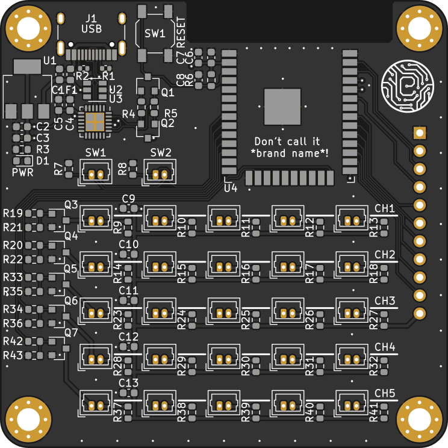
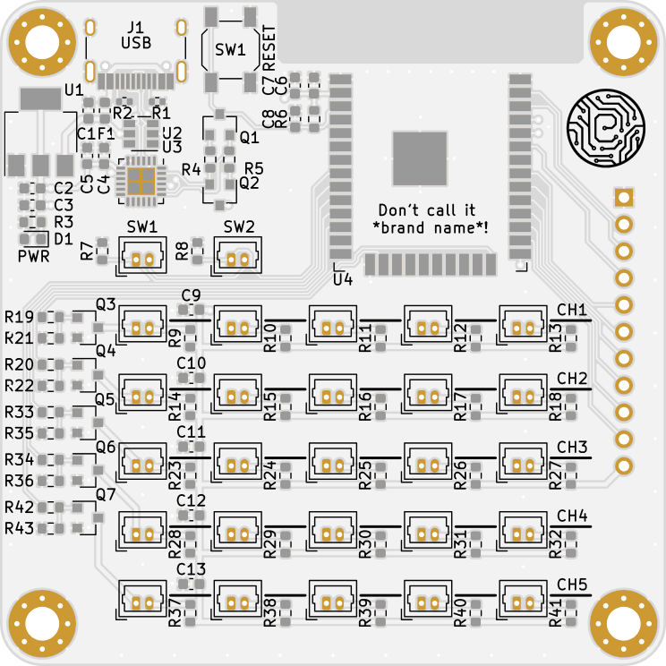
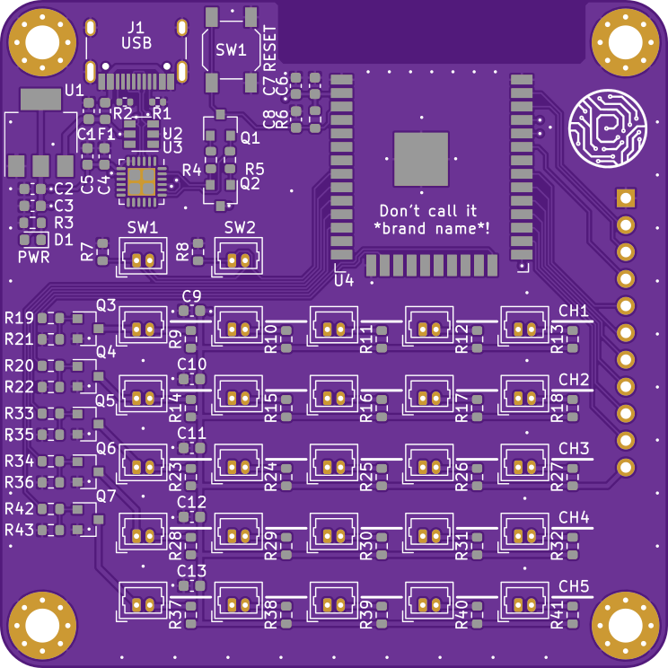
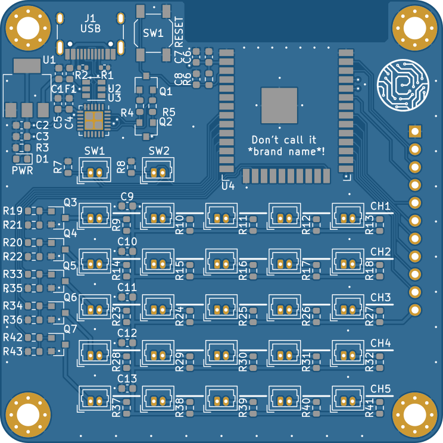

 # tracespace-cli-wrapper

 This is a simple shell script intended to automate use of the [tracespace-cli](https://github.com/tracespace/tracespace/tree/main/packages/cli) project. It allows to select soldermask and silkscreen colors in a simple user input prompt, then calls the tracespace package. Afterwards it uses inkscape to covert the .svg files created by tracespace to slightly more accessible .png images (dpi can be set in a prompt as well).

 Please note: This script is in no way affiliated with the original tracespace project - it was merely written to make using their (awesome) tool a bit easier.

 ## Prerequisites
 * Some POSIX compatible shell (on Windows: WSL1/2)
 * [tracespace-cli](https://github.com/tracespace/tracespace/tree/main/packages/cli) - install notes are in the link. tl;dr: `npm install -g @tracespace/cli`
 * [Inkscape](https://inkscape.org/de/) - install through your distro's package manager, or any other way you want (note: if you are using the WSL, you must install inkscape in the WSL, not on the Windows host!)
 * Download pcbrender.sh and put it in a folder that's part of your $PATH variable - `~/.local/bin/pcbrender.sh` in my case.

 ## How to use
 * Navigate to a folder that contains gerber files
 * run the script (if you added the $PATH correctly, it will work with `pcbrender.sh`)
 * Follow the on-screen-prompts. All choices can be skipped by simply pressing the `enter` key, which will then use the default values (black soldermask, white silkscreen, 300 dpi)

 For easier use, the script accepts optional parameters passed to it via flags. If a valid value is passed via flag, the prompt for it is skipped. If an invalid value or no value is passed, it will prompt as usual.
 * -d: specify the DPI used for the png export. Example: `pcbrender.sh -d 420`
 * -m: specify the soldermask RGB color. Example: `pcbrender.sh -m 0,75,128`
 * -s: specify the silkscreen RGB color. Example: `pcbrender.sh -s 128,75,0`

 ## Screenshot
A screenshot can be found here: [Sample screenshot](img/pcbrender_customcolor.png)
It shows the output of rendering a custom color, showing also the script's reaction to a wrong RGB color input. DPI are also set to a custom value.

 ## Result images
 Some sample results - based on the gerbers of [this project](https://github.com/ebastler/brickcontroller).
 | | | 
 |:---|:---| 
 |  |  |
 | Mask: 0,0,0 (default), Silk: 255,255,255 (default)| Mask: 255,255,255 (white), Silk: 0,0,0 (black)| 
 |  |  | 
 | Mask: 75,0,130 (purple), Silk: 255,255,255 (default)| Mask: 0,75,128 (custom), Silk: 255,255,255 (default)| 